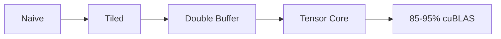

# GEMM Kernels

> This page is under construction. Check back soon for detailed API documentation.

## Overview

GEMM (General Matrix Multiply) is the fundamental operation in deep learning. TensorCraft-HPC provides progressive optimization paths from naive to Tensor Core implementations.

## Optimization Path

## API Reference

Documentation for GEMM kernel functions will be documented here.

## References

See [Papers & Citations](/en/references/papers) for relevant academic references.