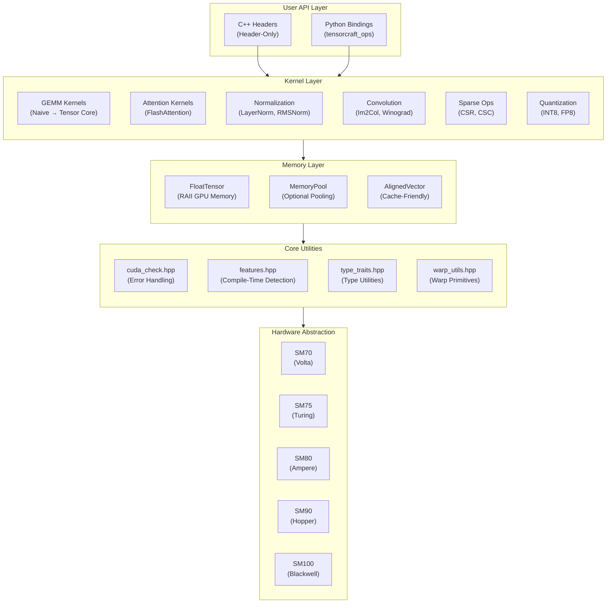
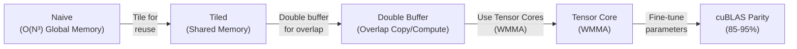
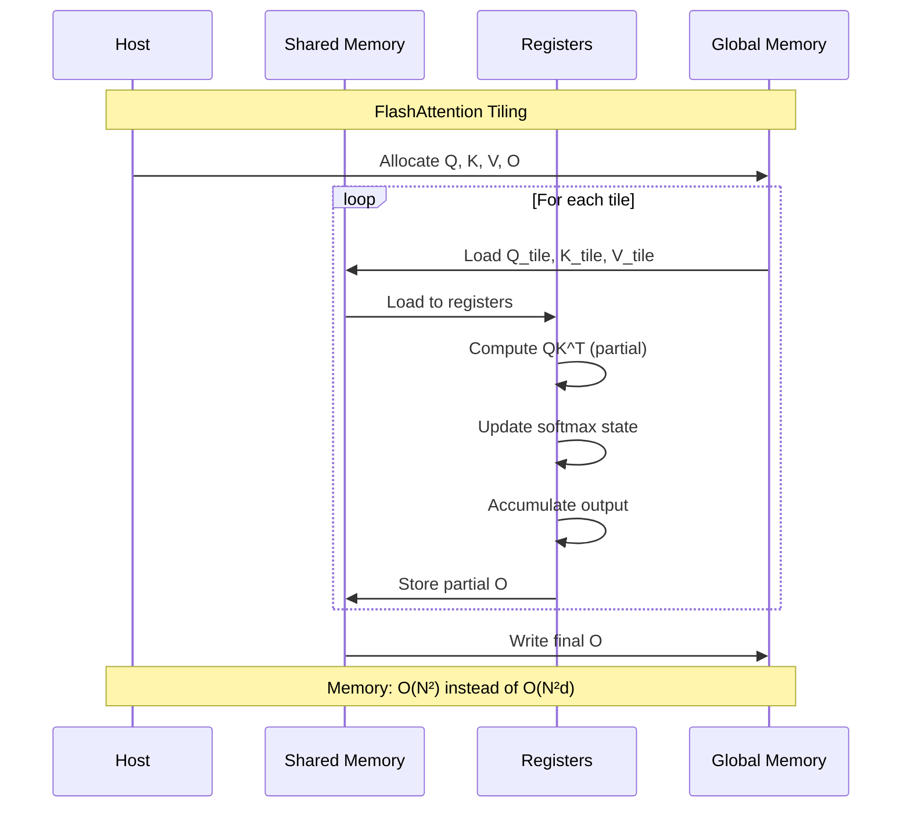
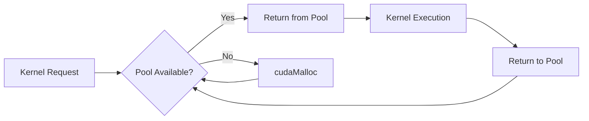
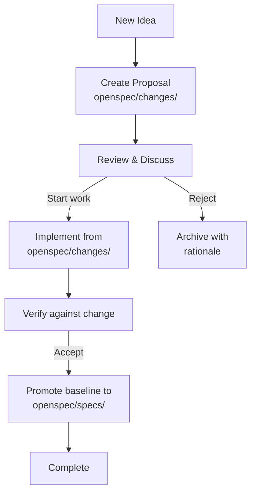

# Architecture Overview

This document describes the high-level architecture of TensorCraft-HPC.

## Design Philosophy {#philosophy}

TensorCraft-HPC follows three core principles:

1. **Readability First** — Code is meant to be read. Each kernel shows the optimization progression.
2. **Header-Only** — Zero build complexity for C++ users. Just include and go.
3. **OpenSpec-Driven** — Active work starts in `openspec/changes/`, while accepted baselines live in `openspec/specs/`.

---

## System Architecture {#system}



---

## Directory Structure {#directories}

```
modern-ai-kernels/
├── include/tensorcraft/       # Header-only library
│   ├── core/                  # Utilities (error handling, type traits)
│   │   ├── cuda_check.hpp     # CUDA error checking macros
│   │   ├── features.hpp       # Compile-time GPU feature detection
│   │   ├── type_traits.hpp    # Type manipulation utilities
│   │   └── warp_utils.hpp     # Warp-level primitives
│   ├── memory/                # Memory management
│   │   ├── tensor.hpp         # RAII GPU tensor wrapper
│   │   ├── memory_pool.hpp    # Optional memory pooling
│   │   └── aligned_vector.hpp # Cache-aligned vectors
│   └── kernels/               # All compute kernels
│       ├── gemm.hpp           # Matrix multiplication
│       ├── attention.hpp      # Attention mechanisms
│       ├── normalization.hpp  # LayerNorm, RMSNorm, etc.
│       ├── softmax.hpp        # Softmax variants
│       ├── conv2d.hpp         # 2D convolution
│       ├── sparse.hpp         # Sparse operations
│       ├── elementwise.hpp    # ReLU, GeLU, etc.
│       ├── memory_ops.hpp     # Copy, transpose
│       └── fusion.hpp         # Fused operators and quantization helpers
├── src/python_ops/            # Python bindings (pybind11)
├── tests/                     # Unit tests (GoogleTest)
├── benchmarks/                # Performance benchmarks
├── examples/                  # Usage examples
├── docs/                      # VitePress documentation
└── openspec/                  # Specification workflow
    ├── specs/                 # Accepted specifications
    ├── changes/               # Active change proposals
    └── archive/               # Completed changes
```

---

## GEMM Optimization Path {#gemm-path}

The GEMM kernel demonstrates the progressive optimization approach:



### Performance Characteristics

| Stage | Memory Traffic | Compute Efficiency | Relative Speed |
|-------|----------------|-------------------|----------------|
| Naive | O(N³) global | ~1% | 1x |
| Tiled | O(N²) global | ~10% | 10x |
| Double Buffer | O(N²) global | ~30% | 30x |
| Tensor Core | O(N²) global | ~80% | 80x |

---

## FlashAttention Implementation {#flash-attention}



### Key Innovations

1. **Tiling** — Process attention in tiles that fit in SRAM
2. **Online Softmax** — Update softmax statistics incrementally
3. **Recomputation** — Recompute attention weights instead of storing

---

## Memory Management {#memory}

### RAII Pattern

```cpp
// Automatic memory management
{
    tensorcraft::FloatTensor A({4096, 4096});
    // Use A...
} // Automatically freed when scope exits
```

### Memory Pool (Optional)



---

## Compile-Time Feature Detection {#features}

The `features.hpp` header provides compile-time GPU capability detection:

```cpp
// Automatically detected at compile time
#if TENSORCRAFT_HAS_WMMA
    // Use Tensor Cores (SM70+)
#endif

#if TENSORCRAFT_HAS_FP8
    // Use FP8 types (SM90+)
#endif

#if TENSORCRAFT_HAS_TMA
    // Use Tensor Memory Accelerator (SM90+)
#endif
```

---

## OpenSpec Workflow {#openspec}



### Specification Structure

Each accepted baseline in `openspec/specs/` contains:
- **Requirements** — What the component must do
- **Contracts** — API guarantees and invariants
- **Acceptance Criteria** — How to verify compliance

---

## Testing Strategy {#testing}

| Level | Tool | Purpose |
|-------|------|---------|
| Unit | GoogleTest | Per-kernel correctness |
| Integration | pytest | Python bindings |
| Benchmark | Google Benchmark | Performance regression |
| Validation | Custom | Numerical accuracy |

### Running Tests

```bash
# All tests
ctest --preset dev --output-on-failure

# Specific kernel
ctest --preset dev -R gemm

# Benchmarks
cmake --preset release
cmake --build --preset release --parallel 2
./build/release/benchmarks/gemm_benchmark
```
