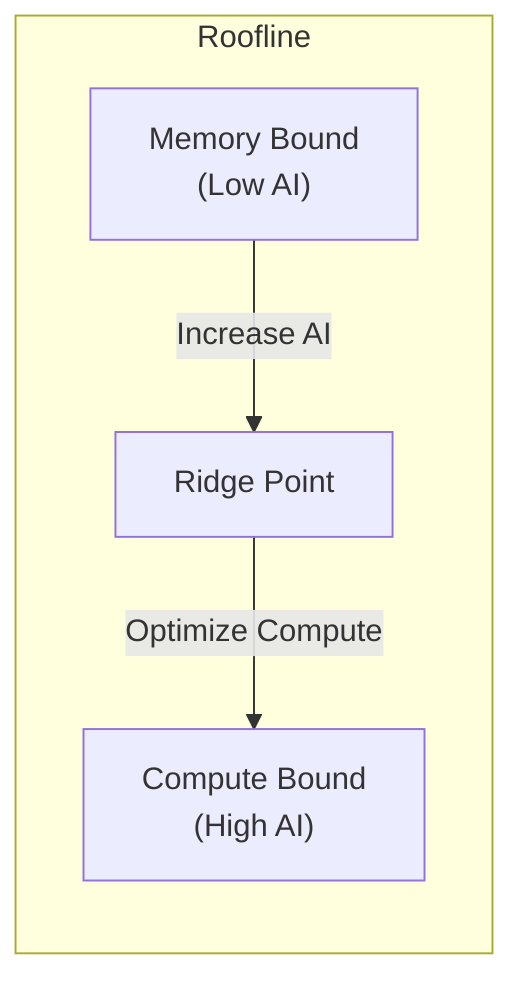

# Benchmarking Guide

How to measure and analyze kernel performance in TensorCraft-HPC.

## Running Benchmarks {#running}

### Built-in Benchmarks

```bash
# Build with benchmarks enabled
cmake --preset release
cmake --build --preset release

# Run GEMM benchmark
./build/benchmarks/gemm_benchmark

# Run attention benchmark
./build/benchmarks/attention_benchmark

# Run normalization benchmark
./build/benchmarks/norm_benchmark
```

### Benchmark Output

```
GEMM Benchmark (A100, CUDA 12.4)
--------------------------------
Size        Time (ms)   TFLOPs    vs cuBLAS
1024x1024   0.42        5.1       92%
2048x2048   2.1         8.2       89%
4096x4096   12.4        11.1      85%
8192x8192   85.2        12.9      82%
```

---

## Profiling Tools {#profiling}

### Nsight Compute

For detailed kernel analysis:

```bash
# Profile a specific kernel
ncu --set full -o profile_report ./build/benchmarks/gemm_benchmark

# View report
ncu-ui profile_report.ncu-rep
```

Key metrics to examine:
- **Memory Throughput** — Achieved vs. peak bandwidth
- **Compute Throughput** — FLOP utilization
- **Warp Execution Efficiency** — Active warp percentage
- **Shared Memory Bank Conflicts** — Serialization events

### Nsight Systems

For timeline analysis:

```bash
# System-wide profiling
nsys profile -o timeline ./build/benchmarks/gemm_benchmark

# View timeline
nsys-ui timeline.qdrep
```

---

## Performance Metrics {#metrics}

### Roofline Model



### Key Metrics

| Metric | Formula | Target |
|--------|---------|--------|
| Arithmetic Intensity | FLOPs / Bytes | > 100 for GEMM |
| Memory Efficiency | Achieved / Peak BW | > 80% |
| Compute Efficiency | Achieved / Peak FLOPS | > 80% |
| Occupancy | Active Warps / Max Warps | 50-100% |

---

## Benchmarking Best Practices {#best-practices}

::: tip Warm-up Runs
Always include warm-up runs to eliminate initialization overhead:
```cpp
// Warm-up
for (int i = 0; i < 10; i++) kernel();

// Timed runs
auto start = std::chrono::high_resolution_clock::now();
for (int i = 0; i < 100; i++) kernel();
auto end = std::chrono::high_resolution_clock::now();
```
:::

::: tip Multiple Runs
Run benchmarks multiple times and report statistics:
```cpp
std::vector<double> times;
for (int run = 0; run < 100; run++) {
    auto t = measure_kernel();
    times.push_back(t);
}
// Report mean, std, min, max
```
:::

::: warning Avoid Micro-benchmarks Pitfalls
- Don't benchmark sizes that fit entirely in cache
- Use realistic input sizes for your use case
- Consider batch effects in production
:::

---

## Comparing to Baselines {#baselines}

### cuBLAS for GEMM

```cpp
#include <cublas_v2.h>

// cuBLAS baseline
cublasHandle_t handle;
cublasCreate(&handle);

float alpha = 1.0f, beta = 0.0f;
cublasSgemm(handle, CUBLAS_OP_N, CUBLAS_OP_N,
            N, M, K, &alpha, B, N, A, K, &beta, C, N);
```

### cuDNN for Convolution

```cpp
#include <cudnn.h>

// cuDNN baseline setup
cudnnHandle_t cudnn;
cudnnCreate(&cudnn);
// ... configure and run
```

---

## Interpreting Results {#interpretation}

### Good Performance Indicators

- ✅ >80% of cuBLAS/cuDNN performance
- ✅ Consistent results across runs
- ✅ Scales linearly with problem size
- ✅ Memory bandwidth near peak

### Warning Signs

- ⚠️ Large variance between runs
- ⚠️ Performance drops at specific sizes
- ⚠️ Much lower than expected throughput
- ⚠️ High bank conflict counts