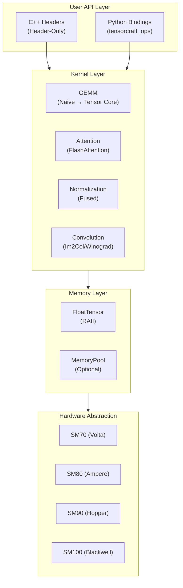

<style>
/* Additional landing page styles */
.VPHero .name {
  background: linear-gradient(135deg, #ffffff 0%, #76B900 100%);
  -webkit-background-clip: text;
  -webkit-text-fill-color: transparent;
  background-clip: text;
}

.VPHero .text {
  color: var(--vp-c-text-1);
}

.VPHero .tagline {
  color: var(--vp-c-text-2);
}
</style>

## Abstract {#abstract}

<div class="abstract">
<div class="abstract-title">Abstract</div>
<div class="abstract-content">

TensorCraft-HPC is a header-only C++/CUDA kernel library designed for learning, validating, and packaging modern AI operators. Unlike production libraries that prioritize raw performance, TensorCraft-HPC emphasizes **readability** and **progressive optimization paths**—each kernel evolves from a naive implementation to an optimized version, making the learning process explicit and accessible.

The repository follows an **OpenSpec-driven development workflow**, where specifications in `openspec/specs/` serve as the authoritative source of truth. This approach ensures documentation stays synchronized with implementation and provides a clear contract for contributors.

</div>
</div>

## Key Contributions {#contributions}

<ul class="contributions">
<li><strong>Educational Kernel Implementations</strong> — Progressive optimization paths from naive to Tensor Core for GEMM, FlashAttention-style memory-efficient attention, and fused normalization kernels.</li>
<li><strong>Header-Only Architecture</strong> — Zero-build integration for C++ projects, with optional Python bindings via pybind11 for experimentation.</li>
<li><strong>Multi-Architecture Support</strong> — CUDA kernels targeting SM70 (Volta) through SM100 (Blackwell), with compile-time feature detection.</li>
<li><strong>OpenSpec Workflow</strong> — Specification-first development with acceptance criteria in `openspec/specs/` and change proposals in `openspec/changes/`.</li>
<li><strong>Bilingual Documentation</strong> — Complete English and Chinese documentation with Mermaid architecture diagrams.</li>
</ul>

## Architecture Overview {#architecture}



## Quick Start {#quick-start}

::: code-group
```bash [Install]
# Clone the repository
git clone https://github.com/LessUp/modern-ai-kernels.git
cd modern-ai-kernels

# Header-only: just include the headers
# For CMake projects:
cmake --preset cpu-smoke
cmake --build --preset cpu-smoke
```

```cpp [C++ Usage]
#include "tensorcraft/kernels/gemm.hpp"
#include "tensorcraft/memory/tensor.hpp"

// Create GPU tensors (RAII-managed)
tensorcraft::FloatTensor A({4096, 4096});
tensorcraft::FloatTensor B({4096, 4096});
tensorcraft::FloatTensor C({4096, 4096});

// Optimized GEMM
tensorcraft::kernels::gemm(A.data(), B.data(), C.data(), 4096, 4096, 4096);
```

```python [Python Usage]
import tensorcraft_ops as tc
import numpy as np

# Use NumPy-compatible API
A = np.random.randn(4096, 4096).astype(np.float32)
B = np.random.randn(4096, 4096).astype(np.float32)
C = tc.gemm(A, B)  # GPU-accelerated

# FlashAttention
Q, K, V = [np.random.randn(32, 128, 64).astype(np.float32) for _ in range(3)]
output = tc.flash_attention(Q, K, V)
```
:::

## Project Status {#status}

| Aspect | Status |
|--------|--------|
| Repository Mode | Stabilization / Closeout |
| Core Kernels | Complete (GEMM, Attention, Norm, Conv) |
| Documentation | OpenSpec-driven, bilingual |
| CUDA Support | 11.0 - 13.1 |
| Architecture Support | SM70 - SM100 (Volta → Blackwell) |

## Citation {#citation}

If you use TensorCraft-HPC in your research or learning materials, please cite:

```bibtex
@software{tensorcraft-hpc,
  title = {TensorCraft-HPC: Demystifying High-Performance AI Kernels},
  author = {LessUp},
  year = {2024},
  url = {https://github.com/LessUp/modern-ai-kernels}
}
```

## References {#references}

See [Papers & Citations](/en/references/papers) for a comprehensive list of academic papers and open-source projects referenced in this repository.