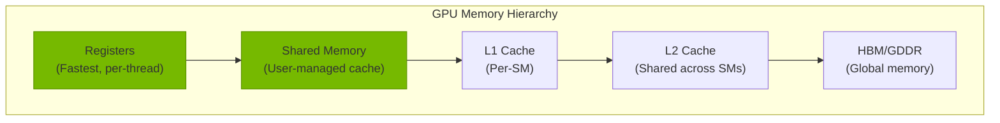
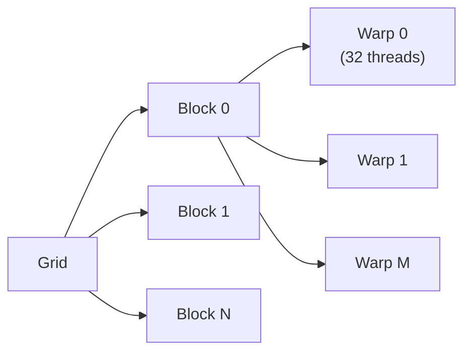

# Learning Resources

A curated list of resources for learning CUDA programming and GPU kernel optimization.

## Suggested reading path

If you are using TensorCraft-HPC as a learning project or interview artifact, this order works well:

1. Read the project [whitepaper](/en/whitepaper/) to understand the repository's design intent.
2. Use this page to branch outward into the core NVIDIA references and neighboring open-source
   projects.
3. Return to the repository's [architecture overview](/en/architecture) and [kernel atlas](/en/api/gemm)
   with that external context in mind.

This makes the project easier to compare honestly against production libraries and research-grade
implementations.

## Official NVIDIA Resources {#nvidia}

### Documentation

- [CUDA C++ Programming Guide](https://docs.nvidia.com/cuda/cuda-c-programming-guide/index.html) — The authoritative reference for CUDA programming
- [CUDA Best Practices Guide](https://docs.nvidia.com/cuda/cuda-best-practices-guide/index.html) — Optimization strategies and common pitfalls
- [CUDA Profiler Tools Interface (CUPTI)](https://docs.nvidia.com/cupti/index.html) — For profiling CUDA applications

### Libraries

- [cuBLAS](https://docs.nvidia.com/cuda/cublas/) — Dense linear algebra
- [cuDNN](https://docs.nvidia.com/deeplearning/cudnn/) — Deep learning primitives
- [cuSPARSE](https://docs.nvidia.com/cuda/cusparse/) — Sparse linear algebra
- [NCCL](https://docs.nvidia.com/deeplearning/nccl/) — Multi-GPU communication

### Tools

- [Nsight Compute](https://docs.nvidia.com/nsight-compute/index.html) — Kernel profiling and analysis
- [Nsight Systems](https://docs.nvidia.com/nsight-systems/index.html) — System-wide profiling
- [NVIDIA Visual Profiler](https://developer.nvidia.com/nvidia-visual-profiler) — Legacy GUI profiler

---

## Open Source Projects {#projects}

### Kernel Libraries

| Project | Focus | Difficulty |
|---------|-------|------------|
| [CUTLASS](https://github.com/NVIDIA/cutlass) | GEMM, Tensor Cores | Advanced |
| [FlashAttention](https://github.com/Dao-AILab/flash-attention) | Attention | Advanced |
| [xFormers](https://github.com/facebookresearch/xformers) | Attention, Memory | Intermediate |
| [Triton](https://github.com/openai/triton) | DSL for kernels | Intermediate |
| [DeepSpeed](https://github.com/microsoft/DeepSpeed) | Training optimization | Advanced |

### How these projects relate to TensorCraft-HPC

| Project | Why compare it | What TensorCraft-HPC emphasizes instead |
|---------|----------------|-----------------------------------------|
| CUTLASS | Canonical CUDA GEMM / Tensor Core engineering | Simpler learning path and clearer optimization narration |
| FlashAttention | Reference-quality attention implementation | Easier-to-follow explanation of tiling and memory trade-offs |
| Triton | Alternative kernel authoring model | Direct C++/CUDA control and closer-to-metal educational examples |
| xFormers / DeepSpeed | Real-world training-system context | Focused operator learning rather than full-stack training infrastructure |

### Educational

| Project | Description |
|---------|-------------|
| [CUDA Mode](https://github.com/cuda-mode) | CUDA learning resources |
| [GPU Mode](https://github.com/gpu-mode) | GPU programming tutorials |
| [Awesome CUDA](https://github.com/Erspamt/awesome-cuda) | Curated CUDA resources |

---

## Books {#books}

### GPU Programming

- **Programming Massively Parallel Processors** — David B. Kirk, Wen-mei W. Hwu
  - The classic textbook for GPU computing
- **CUDA by Example** — Jason Sanders, Edward Kandrot
  - Practical introduction to CUDA
- **Professional CUDA C Programming** — John Cheng, Max Grossman, Phil McGachey
  - Advanced CUDA techniques

### Computer Architecture

- **Computer Architecture: A Quantitative Approach** — Hennessy & Patterson
  - Understanding memory hierarchies and parallelism

---

## Online Courses {#courses}

- [NVIDIA Deep Learning Institute](https://www.nvidia.com/en-us/training/) — Official NVIDIA courses
- [CMU 15-418: Parallel Computer Architecture](http://15418.courses.cs.cmu.edu/) — Excellent course on parallelism
- [MIT 6.172: Performance Engineering](https://ocw.mit.edu/courses/6-172-performance-engineering-of-software-systems-fall-2018/) — Software performance optimization

---

## Key Concepts {#concepts}

### Memory Hierarchy

### Execution Model

### Optimization Priority

1. **Maximize Parallelism** — Enough threads to hide latency
2. **Coalesced Memory Access** — Adjacent threads access adjacent memory
3. **Shared Memory Usage** — Reduce global memory traffic
4. **Bank Conflict Avoidance** — Ensure shared memory efficiency
5. **Occupancy Tuning** — Balance registers, shared memory, threads

## What to borrow into this project

When expanding TensorCraft-HPC, the most valuable ideas to absorb from the surrounding ecosystem are:

- **from CUTLASS**: disciplined tiling vocabulary and Tensor Core decomposition patterns
- **from FlashAttention**: memory-aware storytelling and IO-driven reasoning
- **from Triton**: clear operator-level benchmarking habits and compact examples
- **from Nsight tooling**: evidence-first performance explanations instead of intuition-led guesses

---

## Performance Metrics {#metrics}

| Metric | Description | Target |
|--------|-------------|--------|
| **Throughput** | Operations per second | Roofline limit |
| **Latency** | Time per operation | Minimal |
| **Occupancy** | Active warps / Max warps | 50-100% |
| **Memory Bandwidth** | Bytes transferred / second | ~90% peak |
| **Compute Efficiency** | Achieved / Peak FLOPS | >80% for GEMM |

---

## Common Pitfalls {#pitfalls}

::: warning Memory Coalescing
Non-coalesced memory access can reduce bandwidth by 10-32x. Always ensure adjacent threads access adjacent memory addresses.
:::

::: warning Shared Memory Bank Conflicts
When multiple threads in a warp access the same bank, access is serialized. Use padding or access patterns to avoid.
:::

::: warning Branch Divergence
Divergent branches within a warp execute both paths sequentially. Minimize control flow divergence.
:::

::: tip Profiling First
Always profile before optimizing. Use Nsight Compute to identify actual bottlenecks rather than guessing.
:::
