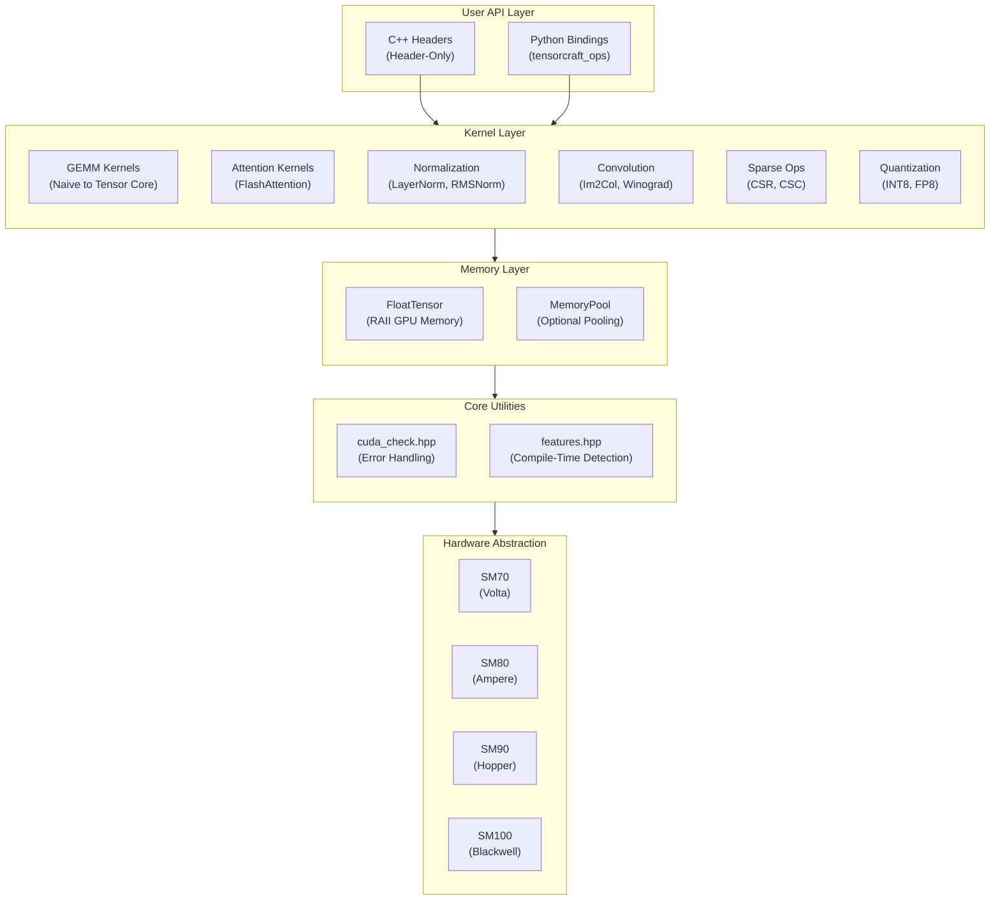
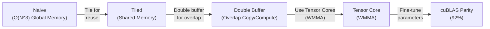
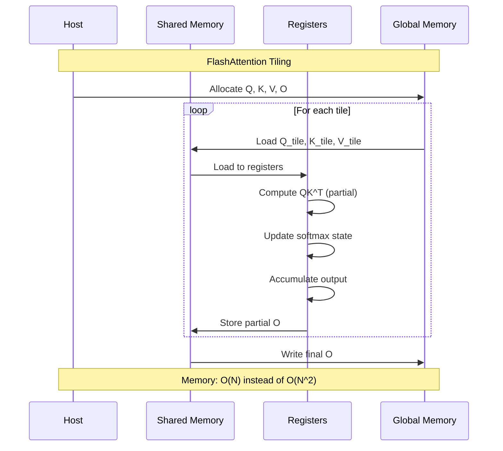
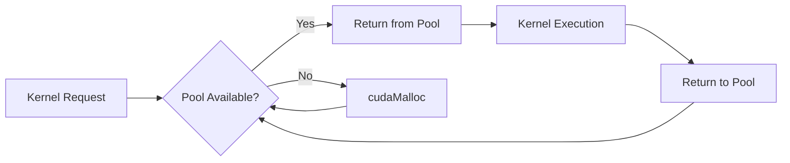
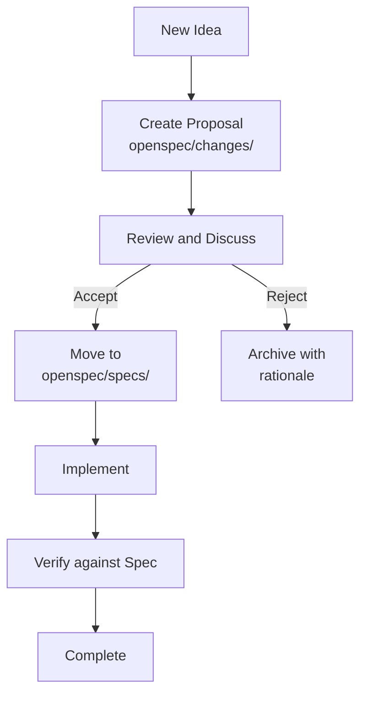

# Architecture

This document describes the system architecture, module design, and extension points of TensorCraft-HPC.

---

## Design Philosophy

TensorCraft-HPC follows three core principles:

1. **Readability first** — Code is written to be read; each kernel demonstrates the optimization progression.
2. **Header-only** — Zero build complexity for C++ users; include and go.
3. **OpenSpec-driven** — The specifications in `openspec/specs/` are the authoritative source for implementation.

---

## System Architecture



---

## Directory Structure

```
modern-ai-kernels/
├── include/tensorcraft/       # Header-only library
│   ├── core/                  # Utilities
│   │   ├── cuda_check.hpp     # CUDA error checking
│   │   ├── features.hpp       # Compile-time GPU detection
│   │   └── type_traits.hpp    # Type utilities
│   ├── memory/                # Memory management
│   │   ├── tensor.hpp         # RAII GPU tensor
│   │   └── memory_pool.hpp    # Optional pooling
│   └── kernels/               # All compute kernels
│       ├── gemm.hpp           # Matrix multiplication
│       ├── attention.hpp      # Attention mechanisms
│       ├── normalization.hpp  # LayerNorm, RMSNorm
│       ├── softmax.hpp        # Softmax variants
│       ├── conv2d.hpp         # 2D convolution
│       ├── sparse.hpp         # Sparse operations
│       └── fusion.hpp         # Fused operators and quantization helpers
├── src/python_ops/            # Python bindings (pybind11)
├── tests/                     # Unit tests (GoogleTest)
├── benchmarks/                # Performance benchmarks
├── docs/                      # VitePress documentation
└── openspec/                  # Specification workflow
    ├── specs/                 # Accepted specifications
    ├── changes/               # Active change proposals
    └── archive/               # Completed changes
```

---

## GEMM Optimization Path

The GEMM kernel demonstrates the progressive optimization approach:



### Performance Characteristics

| Stage | Memory Traffic | Compute Efficiency | Relative Speed |
|-------|----------------|--------------------|----------------|
| Naive | O(N³) global | ~1% | 1x |
| Tiled | O(N²) global | ~10% | 10x |
| Double Buffer | O(N²) global | ~30% | 30x |
| Tensor Core | O(N²) global | ~80% | 80x |

---

## FlashAttention Implementation



### Key Innovations

1. **Tiled computation** — Process attention blocks that fit in SRAM.
2. **Online softmax** — Incrementally update softmax statistics.
3. **Recomputation** — Recompute attention weights rather than storing them.

---

## Memory Management

### RAII Pattern

```cpp
// Automatic memory management
{
    tensorcraft::FloatTensor A({4096, 4096});
    // use A...
} // Released automatically when scope exits
```

### Memory Pool (Optional)



---

## Compile-Time Feature Detection

`features.hpp` provides compile-time GPU capability detection:

```cpp
// Automatically detected at compile time
#if TENSORCRAFT_HAS_WMMA
    // Use Tensor Cores (SM70+)
#endif

#if TENSORCRAFT_HAS_FP8
    // Use FP8 types (SM90+)
#endif

#if TENSORCRAFT_HAS_TMA
    // Use Tensor Memory Accelerator (SM90+)
#endif
```

---

## OpenSpec Workflow



### Spec Structure

Each specification in `openspec/specs/` contains:

- **Requirements** — What the component must do.
- **Contracts** — API guarantees and invariants.
- **Acceptance Criteria** — How to verify compliance.

---

## Extension Points

### Adding a New Kernel

1. Create a spec proposal in `openspec/changes/`.
2. After review, move to `openspec/specs/`.
3. Implement the header in `include/tensorcraft/kernels/`.
4. Add GoogleTest unit tests.
5. Add performance benchmarks.
6. Update documentation.

### Adding Python Bindings

```cpp
// src/python_ops/bindings.cpp
m.def("my_kernel", &tensorcraft::kernels::my_kernel,
    "A new kernel",
    py::arg("input"),
    py::arg("output"));
```
