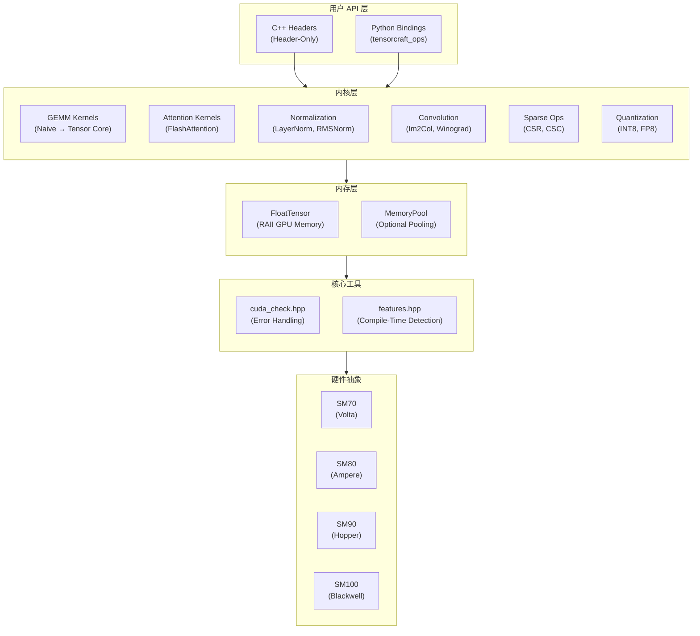
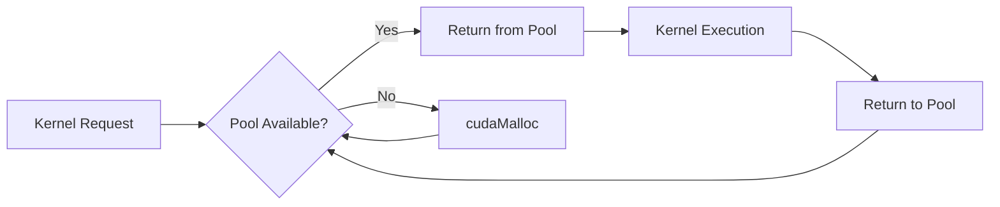

# 架构设计

本文档详细描述 TensorCraft-HPC 的系统架构、模块设计和扩展点。

---

## 设计哲学

TensorCraft-HPC 遵循三个核心原则：

1. **可读性优先** — 代码是为阅读而写的，每个内核展示优化演进过程
2. **仅头文件** — C++ 用户零构建复杂度，直接包含即可使用
3. **OpenSpec 驱动** — `openspec/specs/` 中的规范是实现的权威依据

---

## 系统架构



---

## 目录结构

```
modern-ai-kernels/
├── include/tensorcraft/       # Header-only library
│   ├── core/                  # Utilities
│   │   ├── cuda_check.hpp     # CUDA error checking
│   │   ├── features.hpp       # Compile-time GPU detection
│   │   └── type_traits.hpp    # Type utilities
│   ├── memory/                # Memory management
│   │   ├── tensor.hpp         # RAII GPU tensor
│   │   └── memory_pool.hpp    # Optional pooling
│   └── kernels/               # All compute kernels
│       ├── gemm.hpp           # Matrix multiplication
│       ├── attention.hpp      # Attention mechanisms
│       ├── normalization.hpp  # LayerNorm, RMSNorm
│       ├── softmax.hpp        # Softmax variants
│       ├── conv2d.hpp         # 2D convolution
│       ├── sparse.hpp         # Sparse operations
│       ├── fusion.hpp         # Fused kernels
│       └── fusion.hpp         # Fused operators and quantization helpers
├── src/python_ops/            # Python bindings (pybind11)
├── tests/                     # Unit tests (GoogleTest)
├── benchmarks/                # Performance benchmarks
├── docs/                      # VitePress documentation
└── openspec/                  # Specification workflow
    ├── specs/                 # Accepted specifications
    ├── changes/               # Active change proposals
    └── archive/               # Completed changes
```

---

## GEMM 优化路径

GEMM 内核展示了渐进式优化方法：

```mermaid
flowchart LR
    A["Naive<br/>(O(N³) Global Memory)"]
    B["Tiled<br/>(Shared Memory)"]
    C["Double Buffer<br/>(Overlap Copy/Compute)"]
    D["Tensor Core<br/>(WMMA)"]
    E["cuBLAS Parity<br/>(92%)"]

    A -->|"Tile for<br/>reuse"| B
    B -->|"Double buffer<br/>for overlap"| C
    C -->|"Use Tensor Cores<br/>(WMMA)"| D
    D -->|"Fine-tune<br/>parameters"| E

    style A fill:#F4F7F1,stroke:#2E7D32,color:#1A1A1A
    style B fill:#F4F7F1,stroke:#2E7D32,color:#1A1A1A
    style C fill:#F4F7F1,stroke:#2E7D32,color:#1A1A1A
    style D fill:#2E7D32,stroke:#1B5E20,color:#000
    style E fill:#2E7D32,stroke:#1B5E20,color:#000
```



### 性能特征

| 阶段 | 内存流量 | 计算效率 | 相对速度 |
|------|----------|----------|----------|
| Naive | O(N³) global | ~1% | 1x |
| Tiled | O(N²) global | ~10% | 10x |
| Double Buffer | O(N²) global | ~30% | 30x |
| Tensor Core | O(N²) global | ~80% | 80x |

---

## FlashAttention 实现


### 关键创新

1. **分块计算** — 处理适合 SRAM 的注意力块
2. **在线 Softmax** — 增量更新 softmax 统计量
3. **重计算** — 重新计算注意力权重而非存储

---

## 内存管理

### RAII 模式

```cpp
// 自动内存管理
{
    tensorcraft::FloatTensor A({4096, 4096});
    // 使用 A...
} // 作用域退出时自动释放
```

### 内存池（可选）



---

## 编译时特性检测

`features.hpp` 提供编译时 GPU 能力检测：

```cpp
// 编译时自动检测
#if TENSORCRAFT_HAS_WMMA
    // 使用 Tensor Cores (SM70+)
#endif

#if TENSORCRAFT_HAS_FP8
    // 使用 FP8 类型 (SM90+)
#endif

#if TENSORCRAFT_HAS_TMA
    // 使用 Tensor Memory Accelerator (SM90+)
#endif
```

---

## OpenSpec 工作流


### 规范结构

`openspec/specs/` 中的每个规范包含：

- **需求 (Requirements)** — 组件必须做什么
- **契约 (Contracts)** — API 保证和不变量
- **验收标准 (Acceptance Criteria)** — 如何验证合规性

---

## 扩展点

### 添加新内核

1. 在 `openspec/changes/` 创建规范提案
2. 审核通过后移至 `openspec/specs/`
3. 在 `include/tensorcraft/kernels/` 实现头文件
4. 添加 GoogleTest 单元测试
5. 添加性能基准测试
6. 更新文档

### 添加 Python 绑定

```cpp
// src/python_ops/bindings.cpp
m.def("my_kernel", &tensorcraft::kernels::my_kernel,
    "A new kernel",
    py::arg("input"),
    py::arg("output"));
```
