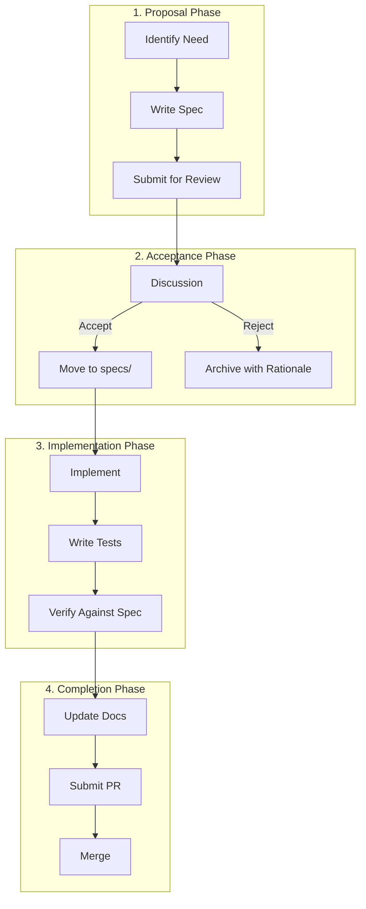

# Development Methodology

This document describes the OpenSpec-driven development workflow and contribution guidelines for TensorCraft-HPC.

---

## OpenSpec Workflow

TensorCraft-HPC uses a specification-first development approach. All significant changes begin as specifications in `openspec/changes/`.

### Workflow Diagram



---

## Specification Structure

Each specification in `openspec/specs/` follows this template:

```yaml
# openspec/specs/kernel-name.md

## Summary
Brief description of the component.

## Requirements
- Functional requirements (what it must do)
- Non-functional requirements (performance, safety)

## Contract
### Input
- Parameter types and constraints

### Output
- Return type and guarantees

### Invariants
- Conditions that always hold

## Acceptance Criteria
- Test cases that verify compliance

## References
- Papers, documentation, related specs
```

---

## Contribution Guidelines

### Code Standards

| Aspect | Requirement |
|--------|-------------|
| Language | C++17, CUDA 11.0+ |
| Style | clang-format (see .clang-format) |
| Linting | clang-tidy (see .clang-tidy) |
| Documentation | Doxygen comments for public API |

### Testing Requirements

1. **Unit Tests**: All public functions must have GoogleTest tests
2. **Numerical Validation**: Compare against reference implementations
3. **Performance Tests**: Include benchmark for critical paths
4. **Edge Cases**: Test boundary conditions and error handling

### Pull Request Process

1. Create specification in `openspec/changes/`
2. Implement changes
3. Add/update tests
4. Update documentation
5. Submit PR with filled template

```markdown
## PR Template

### Specification
Link to the OpenSpec change proposal.

### Changes
Summary of implementation changes.

### Testing
- [ ] Unit tests pass
- [ ] Numerical validation passes
- [ ] Performance benchmarks run
- [ ] Documentation updated

### Performance Impact
Describe any performance changes.
```

---

## Repository Structure Conventions

### Header Files

```cpp
// include/tensorcraft/kernels/example.hpp
#pragma once

#include "tensorcraft/core/cuda_check.hpp"
#include "tensorcraft/memory/tensor.hpp"

namespace tensorcraft::kernels {

/**
 * @brief Brief description of the kernel.
 *
 * Detailed description with usage notes.
 *
 * @param input Input tensor (M×K)
 * @param output Output tensor (M×N)
 * @param M Number of rows
 * @param N Number of columns
 *
 * @throws CudaError if kernel launch fails
 *
 * @performance O(M×N) operations, O(M×N) memory
 */
void example_kernel(
    const float* input,
    float* output,
    size_t M, size_t N
);

} // namespace tensorcraft::kernels
```

### Test Files

```cpp
// tests/kernels/example_test.cpp
#include <gtest/gtest.h>
#include "tensorcraft/kernels/example.hpp"

class ExampleKernelTest : public ::testing::Test {
protected:
    void SetUp() override {
        // Setup code
    }
};

TEST_F(ExampleKernelTest, BasicCorrectness) {
    // Test implementation
}

TEST_F(ExampleKernelTest, EdgeCase) {
    // Edge case test
}
```

---

## Quality Gates

### Pre-commit Hooks

```yaml
# .pre-commit-config.yaml
repos:
  - repo: local
    hooks:
      - id: clang-format
        name: clang-format
        entry: clang-format -i
        types: [c++]
      - id: clang-tidy
        name: clang-tidy
        entry: clang-tidy
        types: [c++]
```

### CI Pipeline


---

## Release Process

### Versioning

TensorCraft-HPC follows [SemVer](https://semver.org/):

- **MAJOR**: Breaking API changes
- **MINOR**: New features, backward compatible
- **PATCH**: Bug fixes

### Release Checklist

1. Update `CHANGELOG.md`
2. Update version in `CMakeLists.txt`
3. Tag release: `git tag v1.2.3`
4. Push tag: `git push --tags`
5. GitHub Actions builds and publishes

---

## Documentation Standards

### API Documentation

Use Doxygen format for C++ API:

```cpp
/**
 * @brief Compute GEMM: C = α(A×B) + βC
 *
 * This function performs general matrix multiplication
 * with optional scaling factors.
 *
 * @tparam T Data type (float, half, bfloat16)
 * @param A Input matrix A (M×K), row-major
 * @param B Input matrix B (K×N), row-major
 * @param C Output matrix C (M×N), row-major
 * @param M Number of rows in A and C
 * @param N Number of columns in B and C
 * @param K Number of columns in A / rows in B
 * @param alpha Scalar multiplier for A×B (default: 1.0)
 * @param beta Scalar multiplier for C (default: 0.0)
 *
 * @throws CudaError if CUDA kernel launch fails
 *
 * @note Requires SM70+ for Tensor Core path
 *
 * @performance
 * - Compute: 2×M×N×K FLOPs
 * - Memory: O(M×K + K×N + M×N) bytes
 *
 * @example
 * ```cpp
 * gemm(A, B, C, 1024, 1024, 1024);
 * ```
 */
template<typename T>
void gemm(const T* A, const T* B, T* C,
          size_t M, size_t N, size_t K,
          T alpha = T(1), T beta = T(0));
```

### User Guide Documentation

User-facing documentation in `docs/` uses VitePress markdown with:

- **Code Groups**: `::: code-group` for multi-language examples
- **Callouts**: `::: tip`, `::: warning`, `::: info`
- **Diagrams**: Mermaid for flowcharts and sequences

---

## Getting Help

- **Issues**: [GitHub Issues](https://github.com/LessUp/modern-ai-kernels/issues)
- **Discussions**: [GitHub Discussions](https://github.com/LessUp/modern-ai-kernels/discussions)
- **Documentation**: [Online Docs](https://aicl-lab.github.io/modern-ai-kernels/)