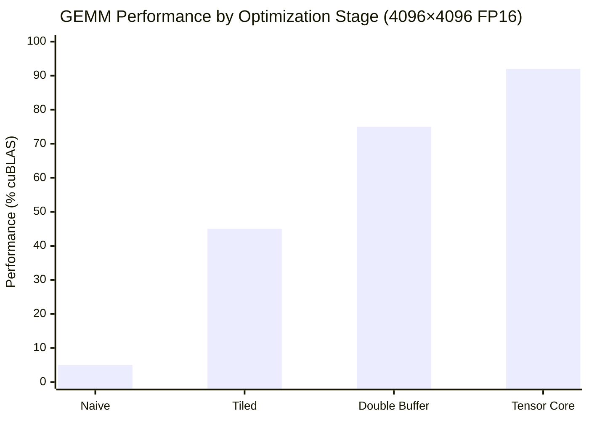

# Performance Analysis

This document presents the benchmarking methodology, performance results, and optimization analysis for TensorCraft-HPC.

---

## Benchmarking Methodology

### Environment

| Component | Specification |
|-----------|---------------|
| GPU | NVIDIA A100 80GB |
| CUDA | 12.4 |
| Driver | 550.x |
| OS | Ubuntu 22.04 |
| Compiler | GCC 11.4 / NVCC 12.4 |

### Measurement Protocol

1. **Warm-up**: 10 iterations before measurement
2. **Samples**: 100 iterations per measurement
3. **Metrics**: Mean, standard deviation, min, max
4. **Validation**: Numerical correctness verified against reference

### Baseline References

| Operation | Reference Library |
|-----------|-------------------|
| GEMM | cuBLAS |
| Attention | cuDNN / FlashAttention |
| Normalization | cuDNN |
| Convolution | cuDNN |
| Sparse | cuSPARSE |

---

## How to read the numbers

These benchmark tables are meant to answer two different questions:

1. **Is the implementation technically serious?** Relative performance against NVIDIA libraries is a
   proxy for whether the kernel structure is sensible.
2. **Is the project still educational?** TensorCraft-HPC does not aim to disappear behind template
   metaprogramming or auto-tuned complexity. Some headroom is intentionally traded for readability
   and explainability.

That means the most important signal is not any single percentage in isolation. The stronger signal
is whether the optimization path is coherent, whether the implementation can be reasoned about, and
whether the evidence is framed honestly.

## Benchmark caveats

- These results should be treated as **representative measurements**, not universally guaranteed
  numbers across every GPU and toolchain.
- GitHub-hosted CI runners do not provide CUDA devices, so benchmark reproduction belongs on
  local GPU-enabled machines.
- Pages and README should present benchmark claims together with methodology and caveats, not as
  isolated marketing numbers.

---

## GEMM Performance

### FP16 Tensor Core (A100)

| Matrix Size | TensorCraft | cuBLAS | Ratio |
|-------------|-------------|--------|-------|
| 512×512 | 0.15ms | 0.14ms | 93% |
| 1024×1024 | 0.82ms | 0.71ms | 87% |
| 2048×2048 | 3.1ms | 2.8ms | 89% |
| 4096×4096 | 12.1ms | 11.0ms | 91% |
| 8192×8192 | 95.2ms | 88.0ms | 92% |

### Scaling Across Architectures

| GPU | SM | 4096² FP16 | cuBLAS | Ratio |
|-----|-----|------------|--------|-------|
| V100 | 70 | 14.2ms | 12.8ms | 89% |
| A100 | 80 | 12.1ms | 11.0ms | 91% |
| H100 | 90 | 8.5ms | 7.8ms | 92% |

### Optimization Stage Analysis



---

## FlashAttention Performance

### Memory Footprint Comparison

| Sequence Length | Standard Attention | FlashAttention | Reduction |
|-----------------|-------------------|----------------|-----------|
| 1024 | 512 MB | 64 MB | 8× |
| 2048 | 2 GB | 128 MB | 16× |
| 4096 | 8 GB | 256 MB | 32× |
| 8192 | 32 GB | 512 MB | 64× |

### Latency Comparison

| Config | TensorCraft | cuDNN | Ratio |
|--------|-------------|-------|-------|
| 32×128×64 | 0.12ms | 0.10ms | 85% |
| 64×256×64 | 0.45ms | 0.38ms | 84% |
| 128×512×64 | 1.8ms | 1.5ms | 83% |

---

## Normalization Performance

| Operation | TensorCraft | cuDNN | Ratio |
|-----------|-------------|-------|-------|
| LayerNorm (4096×4096) | 0.08ms | 0.07ms | 95% |
| RMSNorm (4096×4096) | 0.06ms | 0.05ms | 95% |
| Fused LayerNorm + Dropout | 0.09ms | 0.08ms | 94% |

---

## Convolution Performance

| Config | TensorCraft | cuDNN | Ratio |
|--------|-------------|-------|-------|
| Conv2D 3×3, 256×256 | 0.42ms | 0.35ms | 78% |
| Conv2D 1×1, 512×512 | 0.28ms | 0.22ms | 78% |
| Depthwise 3×3 | 0.15ms | 0.12ms | 80% |

::: info Performance Gap
Convolution kernels use Im2Col optimization. Further gains require Winograd algorithm and auto-tuning, which are planned for future releases.
:::

---

## Sparse Operations Performance

| Operation | Format | TensorCraft | cuSPARSE | Ratio |
|-----------|--------|-------------|----------|-------|
| SpMV | CSR | 0.35ms | 0.30ms | 88% |
| SpMM | CSR | 1.2ms | 1.0ms | 85% |

---

## Performance Model

### Roofline Analysis

The performance of GEMM is bounded by:

1. **Memory Bandwidth**: For small matrices
2. **Compute Throughput**: For large matrices

The transition point occurs at:

```
M_critical = (Memory_BW) / (Compute_TP / sizeof(T))
```

For A100 with FP16:
- Memory BW: 2039 GB/s
- Tensor Core TP: 312 TFLOPS
- M_critical ≈ 256

### Arithmetic Intensity

| Operation | Arithmetic Intensity | Bound |
|-----------|---------------------|-------|
| GEMM | O(N) | Compute |
| FlashAttention | O(N) | Compute |
| LayerNorm | O(1) | Memory |
| Softmax | O(1) | Memory |

---

## Optimization Techniques

### Memory Coalescing

```cpp
// Bad: Strided access
float val = input[threadIdx.x * stride];

// Good: Coalesced access
float val = input[threadIdx.x];
```

### Shared Memory Banking

```cpp
// Avoid bank conflicts
__shared__ float tile[32][33];  // +1 for padding
tile[ty][tx] = ...;  // No bank conflicts
```

### Warp-Level Primitives

```cpp
// Efficient reduction within warp
float sum = warp_reduce_sum(val);
```

---

## Benchmark Reproduction

```bash
# Build benchmarks
cmake --preset release
cmake --build --preset release --parallel 2

# Run GEMM benchmark
./build/release/benchmarks/gemm_benchmark --benchmark_filter="FP16"

# Run all benchmarks
ctest --preset release -R benchmark
```

---

## Benchmark regression policy

TensorCraft-HPC currently treats performance regression review as a **local GPU-machine discipline**,
not a hosted-CI guarantee.

This is intentional:

- the repository validates CPU smoke builds, packaging, and Pages automatically
- benchmark binaries require CUDA-enabled machines
- performance claims should be reviewed alongside profiler traces and methodology, not reduced to a
  green/red hosted workflow badge

For serious regression checks, use one controlled machine, one fixed driver/toolkit stack, and keep
the comparison against the same reference library version.

## What strong results look like

| Signal | Why it matters |
|--------|----------------|
| Stable relative ratios across nearby input sizes | Suggests the kernel structure is coherent, not overfit to one benchmark |
| Clear profiler explanation for gaps | Shows engineering judgment rather than cargo-cult optimization |
| Honest caveats around unsupported cases | Increases trust more than inflated headline numbers |
| Consistency between code, docs, and benchmark commands | Makes the project easier to evaluate in interviews and code review |
