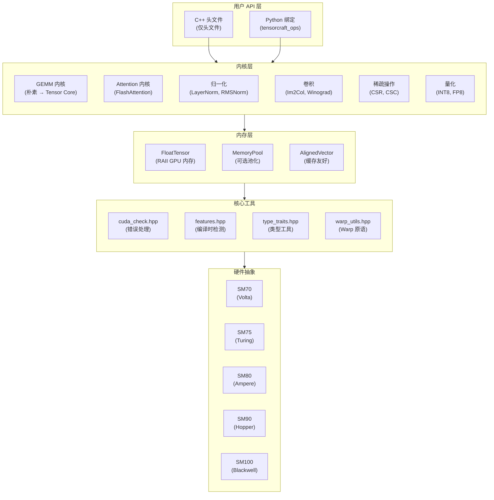
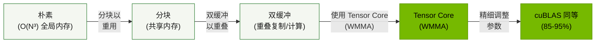
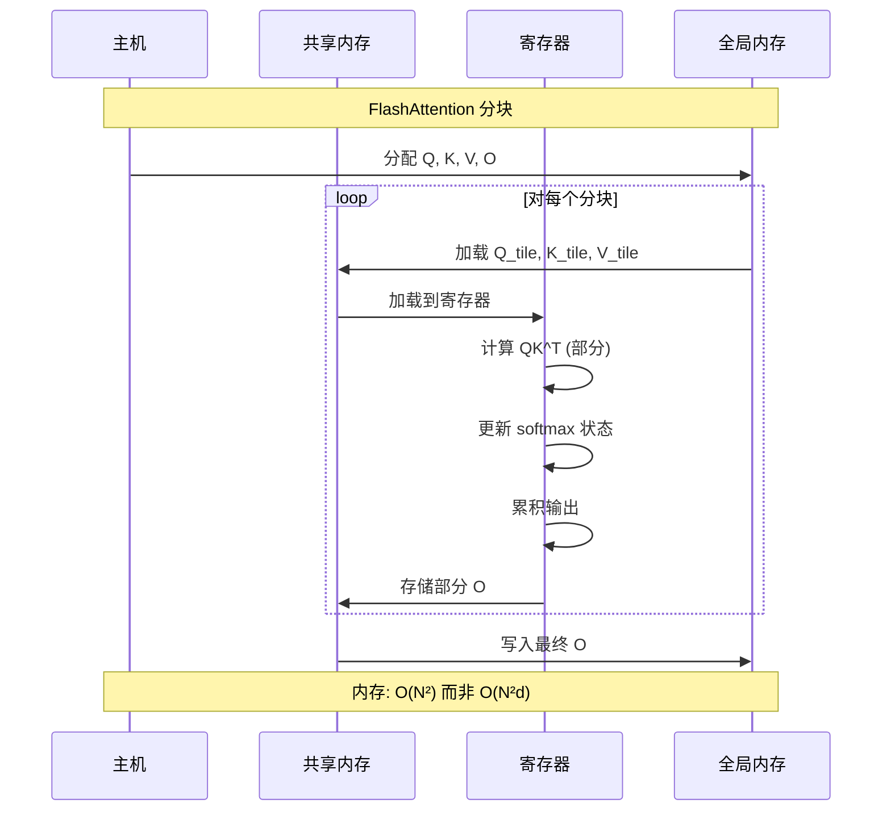
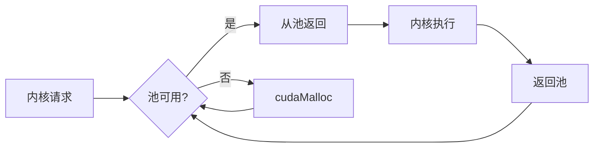
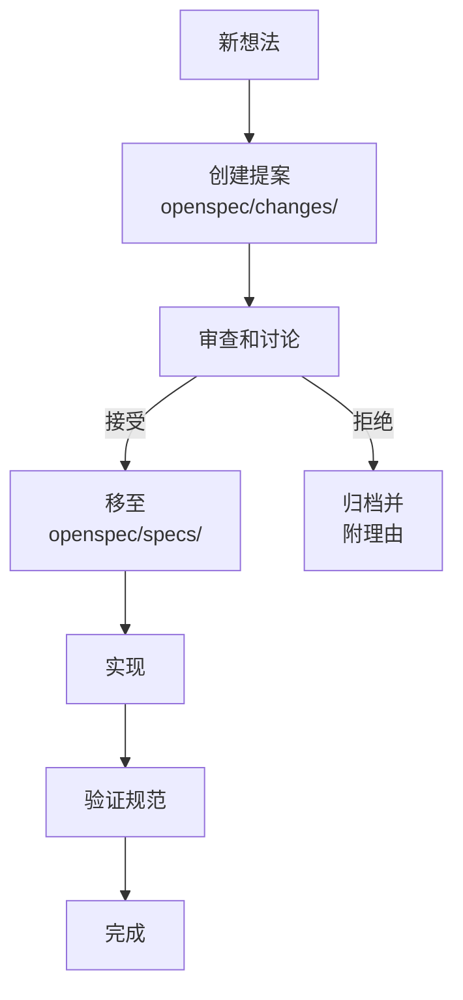

# 架构概览

本文档描述 TensorCraft-HPC 的高层架构。

## 设计理念 {#philosophy}

TensorCraft-HPC 遵循三个核心原则：

1. **可读性优先** — 代码是为了阅读的。每个内核展示优化进程。
2. **仅头文件** — C++ 用户零构建复杂度。只需包含即可使用。
3. **OpenSpec 驱动** — `openspec/specs/` 中的规范是权威来源。

---

## 系统架构 {#system}



---

## 目录结构 {#directories}

```
modern-ai-kernels/
├── include/tensorcraft/       # 仅头文件库
│   ├── core/                  # 工具 (错误处理, 类型特征)
│   │   ├── cuda_check.hpp     # CUDA 错误检查宏
│   │   ├── features.hpp       # 编译时 GPU 特性检测
│   │   ├── type_traits.hpp    # 类型操作工具
│   │   └── warp_utils.hpp     # Warp 级原语
│   ├── memory/                # 内存管理
│   │   ├── tensor.hpp         # RAII GPU 张量包装
│   │   ├── memory_pool.hpp    # 可选内存池化
│   │   └── aligned_vector.hpp # 缓存对齐向量
│   └── kernels/               # 所有计算内核
│       ├── gemm.hpp           # 矩阵乘法
│       ├── attention.hpp      # 注意力机制
│       ├── normalization.hpp  # LayerNorm, RMSNorm 等
│       ├── softmax.hpp        # Softmax 变体
│       ├── conv2d.hpp         # 2D 卷积
│       ├── sparse.hpp         # 稀疏操作
│       ├── fusion.hpp         # 融合内核
│       ├── elementwise.hpp    # ReLU, GeLU 等
│       ├── memory_ops.hpp     # 复制, 转置
│       └── fusion.hpp         # 融合算子与量化辅助能力
├── src/python_ops/            # Python 绑定 (pybind11)
├── tests/                     # 单元测试 (GoogleTest)
├── benchmarks/                # 性能基准
├── examples/                  # 使用示例
├── docs/                      # VitePress 文档
└── openspec/                  # 规范工作流
    ├── specs/                 # 已接受规范
    ├── changes/               # 活动变更提案
    └── archive/               # 已完成变更
```

---

## GEMM 优化路径 {#gemm-path}

GEMM 内核演示了渐进式优化方法：



### 性能特征

| 阶段 | 内存流量 | 计算效率 | 相对速度 |
|------|----------|----------|----------|
| 朴素 | O(N³) 全局 | ~1% | 1x |
| 分块 | O(N²) 全局 | ~10% | 10x |
| 双缓冲 | O(N²) 全局 | ~30% | 30x |
| Tensor Core | O(N²) 全局 | ~80% | 80x |

---

## FlashAttention 实现 {#flash-attention}



### 关键创新

1. **分块** — 处理适合 SRAM 的注意力分块
2. **在线 Softmax** — 增量更新 softmax 统计信息
3. **重计算** — 重计算注意力权重而非存储

---

## 内存管理 {#memory}

### RAII 模式

```cpp
// 自动内存管理
{
    tensorcraft::FloatTensor A({4096, 4096});
    // 使用 A...
} // 作用域退出时自动释放
```

### 内存池 (可选)



---

## 编译时特性检测 {#features}

`features.hpp` 头文件提供编译时 GPU 能力检测：

```cpp
// 编译时自动检测
#if TENSORCRAFT_HAS_WMMA
    // 使用 Tensor Core (SM70+)
#endif

#if TENSORCRAFT_HAS_FP8
    // 使用 FP8 类型 (SM90+)
#endif

#if TENSORCRAFT_HAS_TMA
    // 使用张量内存加速器 (SM90+)
#endif
```

---

## OpenSpec 工作流 {#openspec}



### 规范结构

`openspec/specs/` 中的每个规范包含：
- **需求** — 组件必须做什么
- **契约** — API 保证和不变量
- **验收标准** — 如何验证合规性

---

## 测试策略 {#testing}

| 级别 | 工具 | 目的 |
|------|------|------|
| 单元 | GoogleTest | 每个内核正确性 |
| 集成 | pytest | Python 绑定 |
| 基准 | Google Benchmark | 性能回归 |
| 验证 | 自定义 | 数值精度 |

### 运行测试

```bash
# 所有测试
ctest --preset dev --output-on-failure

# 特定内核
ctest --preset dev -R gemm

# 基准测试
cmake --preset release
cmake --build --preset release --parallel 2
./build/release/benchmarks/gemm_benchmark
```
