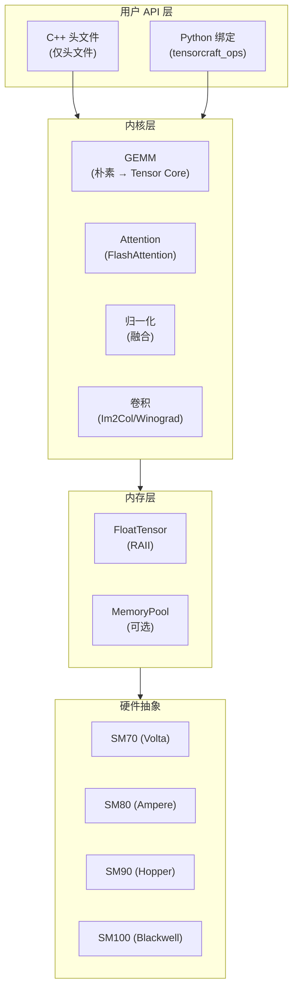

<style>
.VPHero .name {
  background: linear-gradient(135deg, #ffffff 0%, #76B900 100%);
  -webkit-background-clip: text;
  -webkit-text-fill-color: transparent;
  background-clip: text;
}
</style>

## 摘要 {#abstract}

<div class="abstract">
<div class="abstract-title">摘要</div>
<div class="abstract-content">

TensorCraft-HPC 是一个仅头文件的 C++/CUDA 内核库，专为学习、验证和打包现代 AI 算子而设计。与优先考虑原始性能的生产库不同，TensorCraft-HPC 强调**可读性**和**渐进式优化路径**——每个内核从朴素实现演进到优化版本，使学习过程明确且易于理解。

该仓库遵循 **OpenSpec 驱动的开发工作流**，其中 `openspec/specs/` 中的规范作为权威的真实来源。这种方法确保文档与实现保持同步，并为贡献者提供清晰的契约。

</div>
</div>

## 主要贡献 {#contributions}

<ul class="contributions">
<li><strong>教育性内核实现</strong> — 从朴素到 Tensor Core 的渐进式优化路径，包括 GEMM、FlashAttention 风格的内存高效注意力和融合归一化内核。</li>
<li><strong>仅头文件架构</strong> — C++ 项目零构建集成，通过 pybind11 提供可选的 Python 绑定用于实验。</li>
<li><strong>多架构支持</strong> — CUDA 内核目标为 SM70 (Volta) 到 SM100 (Blackwell)，具有编译时特性检测。</li>
<li><strong>OpenSpec 工作流</strong> — 规范优先开发，验收标准在 `openspec/specs/`，变更提案在 `openspec/changes/`。</li>
<li><strong>双语文档</strong> — 完整的中英文文档，配有 Mermaid 架构图。</li>
</ul>

## 架构概览 {#architecture}



## 快速开始 {#quick-start}

::: code-group
```bash [安装]
# 克隆仓库
git clone https://github.com/LessUp/modern-ai-kernels.git
cd modern-ai-kernels

# 仅头文件：只需包含头文件
# 对于 CMake 项目：
cmake --preset cpu-smoke
cmake --build --preset cpu-smoke
```

```cpp [C++ 使用]
#include "tensorcraft/kernels/gemm.hpp"
#include "tensorcraft/memory/tensor.hpp"

// 创建 GPU 张量 (RAII 管理)
tensorcraft::FloatTensor A({4096, 4096});
tensorcraft::FloatTensor B({4096, 4096});
tensorcraft::FloatTensor C({4096, 4096});

// 优化的 GEMM
tensorcraft::kernels::gemm(A.data(), B.data(), C.data(), 4096, 4096, 4096);
```

```python [Python 使用]
import tensorcraft_ops as tc
import numpy as np

# 使用 NumPy 兼容 API
A = np.random.randn(4096, 4096).astype(np.float32)
B = np.random.randn(4096, 4096).astype(np.float32)
C = tc.gemm(A, B)  # GPU 加速

# FlashAttention
Q, K, V = [np.random.randn(32, 128, 64).astype(np.float32) for _ in range(3)]
output = tc.flash_attention(Q, K, V)
```
:::

## 项目状态 {#status}

| 方面 | 状态 |
|------|------|
| 仓库模式 | 稳定化 / 收尾 |
| 核心内核 | 完成 (GEMM, Attention, Norm, Conv) |
| 文档 | OpenSpec 驱动，双语 |
| CUDA 支持 | 11.0 - 13.1 |
| 架构支持 | SM70 - SM100 (Volta → Blackwell) |

## 引用 {#citation}

如果您在研究或学习材料中使用 TensorCraft-HPC，请引用：

```bibtex
@software{tensorcraft-hpc,
  title = {TensorCraft-HPC: Demystifying High-Performance AI Kernels},
  author = {LessUp},
  year = {2024},
  url = {https://github.com/LessUp/modern-ai-kernels}
}
```

## 参考资料 {#references}

参见 [论文引用](/zh/references/papers) 获取本仓库引用的学术论文和开源项目完整列表。