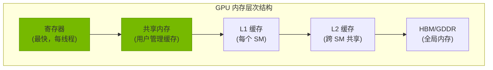
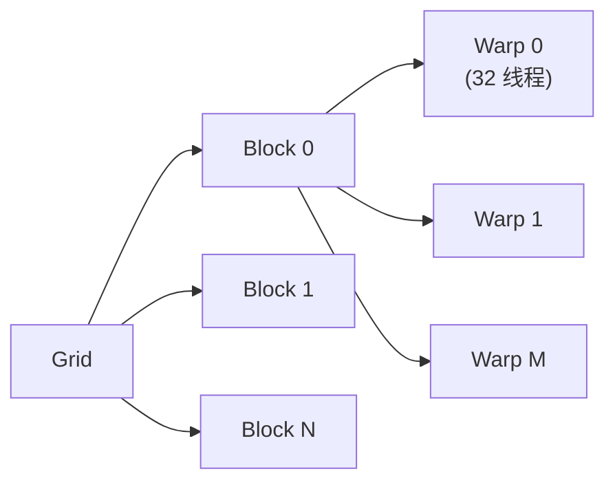

# 学习资源

精选的 CUDA 编程和 GPU 内核优化学习资源列表。

## NVIDIA 官方资源 {#nvidia}

### 文档

- [CUDA C++ 编程指南](https://docs.nvidia.com/cuda/cuda-c-programming-guide/index.html) — CUDA 编程的权威参考
- [CUDA 最佳实践指南](https://docs.nvidia.com/cuda/cuda-best-practices-guide/index.html) — 优化策略和常见陷阱
- [CUDA 分析器工具接口 (CUPTI)](https://docs.nvidia.com/cupti/index.html) — 用于分析 CUDA 应用程序

### 库

- [cuBLAS](https://docs.nvidia.com/cuda/cublas/) — 稠密线性代数
- [cuDNN](https://docs.nvidia.com/deeplearning/cudnn/) — 深度学习原语
- [cuSPARSE](https://docs.nvidia.com/cuda/cusparse/) — 稀疏线性代数
- [NCCL](https://docs.nvidia.com/deeplearning/nccl/) — 多 GPU 通信

### 工具

- [Nsight Compute](https://docs.nvidia.com/nsight-compute/index.html) — 内核分析和剖析
- [Nsight Systems](https://docs.nvidia.com/nsight-systems/index.html) — 系统级分析
- [NVIDIA Visual Profiler](https://developer.nvidia.com/nvidia-visual-profiler) — 传统 GUI 分析器

---

## 开源项目 {#projects}

### 内核库

| 项目 | 重点 | 难度 |
|------|------|------|
| [CUTLASS](https://github.com/NVIDIA/cutlass) | GEMM, Tensor Core | 高级 |
| [FlashAttention](https://github.com/Dao-AILab/flash-attention) | 注意力 | 高级 |
| [xFormers](https://github.com/facebookresearch/xformers) | 注意力, 内存 | 中级 |
| [Triton](https://github.com/openai/triton) | 内核 DSL | 中级 |
| [DeepSpeed](https://github.com/microsoft/DeepSpeed) | 训练优化 | 高级 |

### 教育性

| 项目 | 描述 |
|------|------|
| [CUDA Mode](https://github.com/cuda-mode) | CUDA 学习资源 |
| [GPU Mode](https://github.com/gpu-mode) | GPU 编程教程 |
| [Awesome CUDA](https://github.com/Erspamt/awesome-cuda) | CUDA 资源精选 |

---

## 书籍 {#books}

### GPU 编程

- **Programming Massively Parallel Processors** — David B. Kirk, Wen-mei W. Hwu
  - GPU 计算的经典教科书
- **CUDA by Example** — Jason Sanders, Edward Kandrot
  - CUDA 实践入门
- **Professional CUDA C Programming** — John Cheng, Max Grossman, Phil McGachey
  - 高级 CUDA 技术

### 计算机体系结构

- **Computer Architecture: A Quantitative Approach** — Hennessy & Patterson
  - 理解内存层次结构和并行性

---

## 在线课程 {#courses}

- [NVIDIA 深度学习学院](https://www.nvidia.com/en-us/training/) — NVIDIA 官方课程
- [CMU 15-418: Parallel Computer Architecture](http://15418.courses.cs.cmu.edu/) — 优秀的并行计算课程
- [MIT 6.172: Performance Engineering](https://ocw.mit.edu/courses/6-172-performance-engineering-of-software-systems-fall-2018/) — 软件性能优化

---

## 关键概念 {#concepts}

### 内存层次结构

### 执行模型

### 优化优先级

1. **最大化并行性** — 足够的线程来隐藏延迟
2. **合并内存访问** — 相邻线程访问相邻内存
3. **共享内存使用** — 减少全局内存流量
4. **避免 Bank 冲突** — 确保共享内存效率
5. **占用率调优** — 平衡寄存器、共享内存、线程

---

## 性能指标 {#metrics}

| 指标 | 描述 | 目标 |
|------|------|------|
| **吞吐量** | 每秒操作数 | Roofline 极限 |
| **延迟** | 每次操作时间 | 最小化 |
| **占用率** | 活动 Warp / 最大 Warp | 50-100% |
| **内存带宽** | 每秒传输字节数 | ~90% 峰值 |
| **计算效率** | 实际 / 峰值 FLOPS | >80% 对于 GEMM |

---

## 常见陷阱 {#pitfalls}

::: warning 内存合并
非合并内存访问可能将带宽降低 10-32 倍。始终确保相邻线程访问相邻内存地址。
:::

::: warning 共享内存 Bank 冲突
当 Warp 中的多个线程访问同一个 Bank 时，访问会被串行化。使用填充或访问模式来避免。
:::

::: warning 分支分歧
Warp 内的分歧分支会顺序执行两条路径。最小化控制流分歧。
:::

::: tip 先分析
在优化之前始终进行分析。使用 Nsight Compute 识别实际瓶颈，而不是猜测。
:::