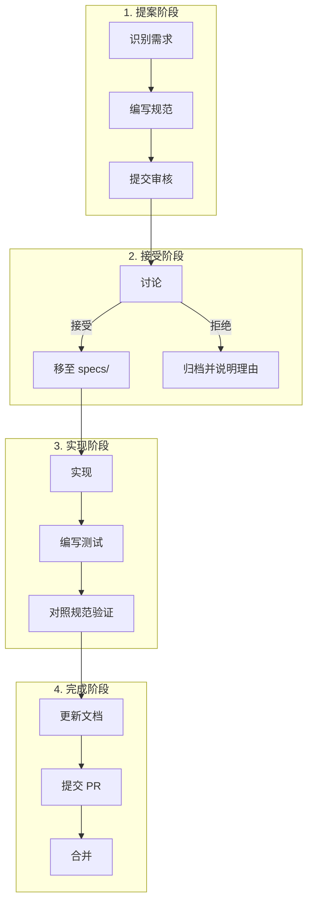

# 开发方法论

本文档描述 TensorCraft-HPC 的 OpenSpec 驱动开发工作流和贡献指南。

---

## OpenSpec 工作流

TensorCraft-HPC 使用规范优先的开发方法。所有重要变更都以 `openspec/changes/` 中的规范开始。

### 工作流图



---

## 规范结构

`openspec/specs/` 中的每个规范遵循此模板：

```yaml
# openspec/specs/kernel-name.md

## Summary
组件的简要描述。

## Requirements
- 功能需求（必须做什么）
- 非功能需求（性能、安全性）

## Contract
### Input
- 参数类型和约束

### Output
- 返回类型和保证

### Invariants
- 始终成立的条件

## Acceptance Criteria
- 验证合规性的测试用例

## References
- 论文、文档、相关规范
```

---

## 贡献指南

### 代码标准

| 方面 | 要求 |
|------|------|
| 语言 | C++17, CUDA 11.0+ |
| 风格 | clang-format（见 .clang-format） |
| 检查 | clang-tidy（见 .clang-tidy） |
| 文档 | 公共 API 的 Doxygen 注释 |

### 测试要求

1. **单元测试**：所有公共函数必须有 GoogleTest 测试
2. **数值验证**：与参考实现对比
3. **性能测试**：包含关键路径的基准测试
4. **边界情况**：测试边界条件和错误处理

### Pull Request 流程

1. 在 `openspec/changes/` 创建规范
2. 实现变更
3. 添加/更新测试
4. 更新文档
5. 提交 PR 并填写模板

```markdown
## PR 模板

### Specification
OpenSpec 变更提案链接。

### Changes
实现变更摘要。

### Testing
- [ ] 单元测试通过
- [ ] 数值验证通过
- [ ] 性能基准测试运行
- [ ] 文档更新

### Performance Impact
描述任何性能变化。
```

---

## 仓库结构约定

### 头文件

```cpp
// include/tensorcraft/kernels/example.hpp
#pragma once

#include "tensorcraft/core/cuda_check.hpp"
#include "tensorcraft/memory/tensor.hpp"

namespace tensorcraft::kernels {

/**
 * @brief 内核的简要描述。
 *
 * 详细描述和使用说明。
 *
 * @param input 输入张量 (M×K)
 * @param output 输出张量 (M×N)
 * @param M 行数
 * @param N 列数
 *
 * @throws CudaError 如果内核启动失败
 *
 * @performance O(M×N) 操作，O(M×N) 内存
 */
void example_kernel(
    const float* input,
    float* output,
    size_t M, size_t N
);

} // namespace tensorcraft::kernels
```

### 测试文件

```cpp
// tests/kernels/example_test.cpp
#include <gtest/gtest.h>
#include "tensorcraft/kernels/example.hpp"

class ExampleKernelTest : public ::testing::Test {
protected:
    void SetUp() override {
        // 设置代码
    }
};

TEST_F(ExampleKernelTest, BasicCorrectness) {
    // 测试实现
}

TEST_F(ExampleKernelTest, EdgeCase) {
    // 边界情况测试
}
```

---

## 质量门禁

### Pre-commit 钩子

```yaml
# .pre-commit-config.yaml
repos:
  - repo: local
    hooks:
      - id: clang-format
        name: clang-format
        entry: clang-format -i
        types: [c++]
      - id: clang-tidy
        name: clang-tidy
        entry: clang-tidy
        types: [c++]
```

### CI 流水线


---

## 发布流程

### 版本控制

TensorCraft-HPC 遵循 [SemVer](https://semver.org/)：

- **主版本号 (MAJOR)**：破坏性 API 变更
- **次版本号 (MINOR)**：新功能，向后兼容
- **修订号 (PATCH)**：Bug 修复

### 发布清单

1. 更新 `CHANGELOG.md`
2. 更新 `CMakeLists.txt` 中的版本
3. 打标签：`git tag v1.2.3`
4. 推送标签：`git push --tags`
5. GitHub Actions 构建并发布

---

## 文档标准

### API 文档

C++ API 使用 Doxygen 格式：

```cpp
/**
 * @brief 计算 GEMM：C = α(A×B) + βC
 *
 * 此函数执行通用矩阵乘法，可选缩放因子。
 *
 * @tparam T 数据类型（float, half, bfloat16）
 * @param A 输入矩阵 A (M×K)，行主序
 * @param B 输入矩阵 B (K×N)，行主序
 * @param C 输出矩阵 C (M×N)，行主序
 * @param M A 和 C 的行数
 * @param N B 和 C 的列数
 * @param K A 的列数 / B 的行数
 * @param alpha A×B 的标量乘数（默认：1.0）
 * @param beta C 的标量乘数（默认：0.0）
 *
 * @throws CudaError 如果 CUDA 内核启动失败
 *
 * @note Tensor Core 路径需要 SM70+
 *
 * @performance
 * - 计算：2×M×N×K FLOPs
 * - 内存：O(M×K + K×N + M×N) 字节
 *
 * @example
 * ```cpp
 * gemm(A, B, C, 1024, 1024, 1024);
 * ```
 */
template<typename T>
void gemm(const T* A, const T* B, T* C,
          size_t M, size_t N, size_t K,
          T alpha = T(1), T beta = T(0));
```

### 用户指南文档

`docs/` 中的用户面向文档使用 VitePress markdown：

- **代码组**：`::: code-group` 用于多语言示例
- **提示框**：`::: tip`、`::: warning`、`::: info`
- **图表**：Mermaid 用于流程图和时序图

---

## 获取帮助

- **问题**：[GitHub Issues](https://github.com/LessUp/modern-ai-kernels/issues)
- **讨论**：[GitHub Discussions](https://github.com/LessUp/modern-ai-kernels/discussions)
- **文档**：[在线文档](https://aicl-lab.github.io/modern-ai-kernels/)