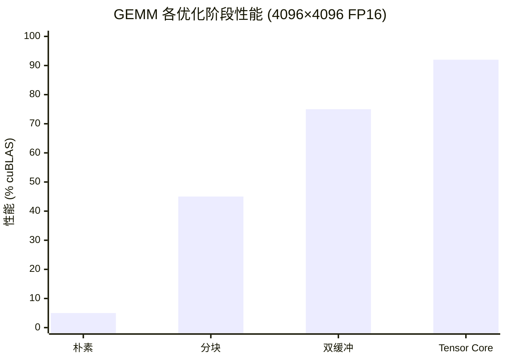

# 性能分析

本文档展示 TensorCraft-HPC 的基准测试方法、性能结果和优化分析。

---

## 基准测试方法

### 测试环境

| 组件 | 规格 |
|------|------|
| GPU | NVIDIA A100 80GB |
| CUDA | 12.4 |
| 驱动 | 550.x |
| 操作系统 | Ubuntu 22.04 |
| 编译器 | GCC 11.4 / NVCC 12.4 |

### 测量协议

1. **预热**：测量前运行 10 次迭代
2. **采样**：每次测量运行 100 次迭代
3. **指标**：均值、标准差、最小值、最大值
4. **验证**：数值正确性通过参考实现验证

### 基准参考

| 操作 | 参考库 |
|------|--------|
| GEMM | cuBLAS |
| Attention | cuDNN / FlashAttention |
| Normalization | cuDNN |
| Convolution | cuDNN |
| Sparse | cuSPARSE |

---

## 应该如何理解这些数字

这些 benchmark 表格主要回答两个问题：

1. **实现是否足够认真？** 与 NVIDIA 库的相对性能可以用来判断内核结构是否合理。
2. **项目是否仍然保持教育价值？** TensorCraft-HPC 不追求把所有复杂度都藏进模板元编程和自动调优里，
   一部分性能空间会被有意地让给可读性和可解释性。

因此，真正重要的不是某一个百分比本身，而是：优化路径是否连贯、实现是否讲得清楚、证据是否表达诚实。

## Benchmark 使用注意

- 这些结果更适合被视为**代表性测量**，而不是在所有 GPU 和工具链上的统一保证。
- GitHub 托管 CI 没有 CUDA 设备，所以 benchmark 复现应在本地 GPU 机器上完成。
- Pages 和 README 中的性能数字必须和方法说明、限制条件一起出现，而不是孤立地作为宣传语。

---

## GEMM 性能

### FP16 Tensor Core (A100)

| 矩阵大小 | TensorCraft | cuBLAS | 比率 |
|----------|-------------|--------|------|
| 512×512 | 0.15ms | 0.14ms | 93% |
| 1024×1024 | 0.82ms | 0.71ms | 87% |
| 2048×2048 | 3.1ms | 2.8ms | 89% |
| 4096×4096 | 12.1ms | 11.0ms | 91% |
| 8192×8192 | 95.2ms | 88.0ms | 92% |

### 跨架构扩展

| GPU | SM | 4096² FP16 | cuBLAS | 比率 |
|-----|-----|------------|--------|------|
| V100 | 70 | 14.2ms | 12.8ms | 89% |
| A100 | 80 | 12.1ms | 11.0ms | 91% |
| H100 | 90 | 8.5ms | 7.8ms | 92% |

### 优化阶段分析



---

## FlashAttention 性能

### 内存占用对比

| 序列长度 | 标准 Attention | FlashAttention | 减少 |
|----------|----------------|----------------|------|
| 1024 | 512 MB | 64 MB | 8× |
| 2048 | 2 GB | 128 MB | 16× |
| 4096 | 8 GB | 256 MB | 32× |
| 8192 | 32 GB | 512 MB | 64× |

### 延迟对比

| 配置 | TensorCraft | cuDNN | 比率 |
|------|-------------|-------|------|
| 32×128×64 | 0.12ms | 0.10ms | 85% |
| 64×256×64 | 0.45ms | 0.38ms | 84% |
| 128×512×64 | 1.8ms | 1.5ms | 83% |

---

## 归一化性能

| 操作 | TensorCraft | cuDNN | 比率 |
|------|-------------|-------|------|
| LayerNorm (4096×4096) | 0.08ms | 0.07ms | 95% |
| RMSNorm (4096×4096) | 0.06ms | 0.05ms | 95% |
| Fused LayerNorm + Dropout | 0.09ms | 0.08ms | 94% |

---

## 卷积性能

| 配置 | TensorCraft | cuDNN | 比率 |
|------|-------------|-------|------|
| Conv2D 3×3, 256×256 | 0.42ms | 0.35ms | 78% |
| Conv2D 1×1, 512×512 | 0.28ms | 0.22ms | 78% |
| Depthwise 3×3 | 0.15ms | 0.12ms | 80% |

::: info 性能差距
卷积内核使用 Im2Col 优化。进一步改进需要 Winograd 算法和自动调优，计划在未来版本中实现。
:::

---

## 稀疏操作性能

| 操作 | 格式 | TensorCraft | cuSPARSE | 比率 |
|------|------|-------------|----------|------|
| SpMV | CSR | 0.35ms | 0.30ms | 88% |
| SpMM | CSR | 1.2ms | 1.0ms | 85% |

---

## 性能模型

### Roofline 分析

GEMM 性能受以下因素约束：

1. **内存带宽**：小矩阵
2. **计算吞吐量**：大矩阵

转换点发生在：

```
M_critical = (Memory_BW) / (Compute_TP / sizeof(T))
```

对于 A100 FP16：
- 内存带宽：2039 GB/s
- Tensor Core 吞吐量：312 TFLOPS
- M_critical ≈ 256

### 算术强度

| 操作 | 算术强度 | 约束 |
|------|----------|------|
| GEMM | O(N) | 计算 |
| FlashAttention | O(N) | 计算 |
| LayerNorm | O(1) | 内存 |
| Softmax | O(1) | 内存 |

---

## 优化技术

### 内存合并访问

```cpp
// 差：跨步访问
float val = input[threadIdx.x * stride];

// 好：合并访问
float val = input[threadIdx.x];
```

### 共享内存存储体

```cpp
// 避免存储体冲突
__shared__ float tile[32][33];  // +1 用于填充
tile[ty][tx] = ...;  // 无存储体冲突
```

### Warp 级原语

```cpp
// 高效的 warp 内归约
float sum = warp_reduce_sum(val);
```

---

## 基准测试复现

```bash
# 构建基准测试
cmake --preset release
cmake --build --preset release --parallel 2

# 运行 GEMM 基准测试
./build/release/benchmarks/gemm_benchmark --benchmark_filter="FP16"

# 运行所有基准测试
ctest --preset release -R benchmark
```

---

## Benchmark 回归策略

TensorCraft-HPC 目前把性能回归检查视为**本地 GPU 机器上的工程纪律**，而不是托管 CI 的强保证。

这样做是有意的：

- 仓库会自动验证 CPU smoke build、打包和 Pages
- benchmark 二进制需要带 CUDA 的本地机器
- 性能判断应该结合 profiler 结果和方法说明，而不是只依赖一个托管 workflow 的绿灯

如果要做严肃的回归检查，请固定机器、驱动、CUDA 版本和参考库版本，再进行对比。

## 什么样的结果更有说服力

| 信号 | 为什么重要 |
|------|------------|
| 相邻输入规模下相对性能稳定 | 说明内核结构是连贯的，而不是只对一个点做了过拟合 |
| 能解释性能差距来自哪里 | 体现工程判断，而不是盲目追求“数字好看” |
| 对不支持场景有明确说明 | 比夸大 headline 数字更能建立信任 |
| 代码、文档、命令路径保持一致 | 更适合面试展示、代码审查和社区评估 |
